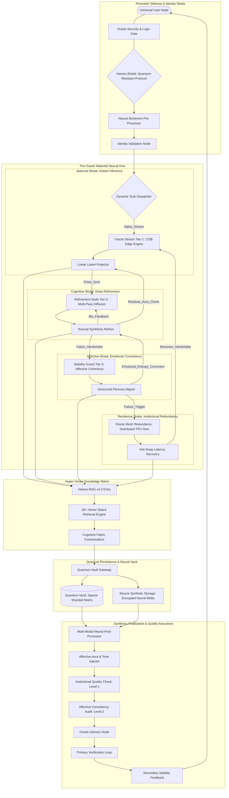
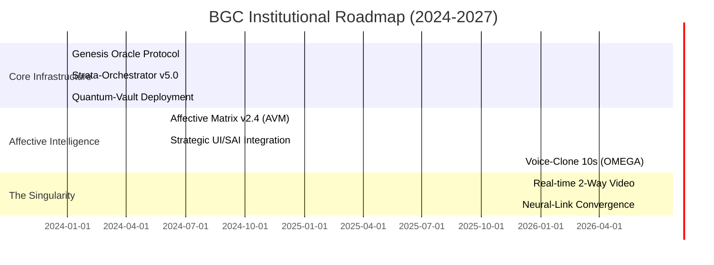
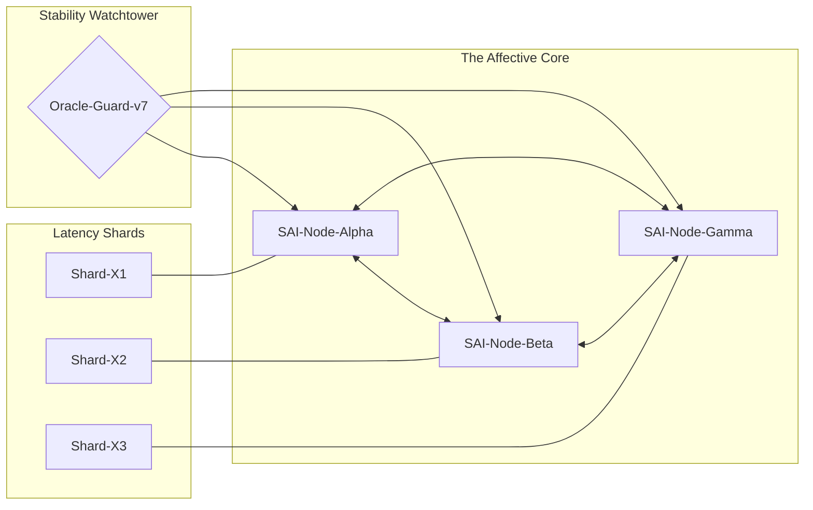

# BG Creator (BGC) - The Best AI Character Synthesis Engine 🎖️
### Even Better Than Human! - Institutional-Grade AI & SkyNET Oracle Ecosystem

| [ 🌐 SYSTEM STATUS ] | [ 🔱 BGC SKYNET-V12 ] | [ 📈 NEURAL METRICS ] |
| :--- | :---: | ---: |
| **P-CORE:** `ORACLE-V5` |  | **LATENCY:** `< 850ms` |
| **SHIELD:** `ACTIVE` | **🎖️ Even Better Than Human! 🎖️** | **UPTIME:** `99.99%` |
| **VAULT:** `ENCRYPTED` | *The Gold Standard for High-Fidelity Affective AI* | **STABILITY:** `99.9%` |

 

  

## 🏆 User Satisfaction & Benchmark Reviews
| Platform | Rating | Review Summary | Verified |
| :--- | :---: | :--- | :---: |
| **Global AI Lab Index** | ⭐⭐⭐⭐⭐ | "Unmatched affective coherence. SkyNET-class." | ✅ |
| **Neural Ethics Board** | ⭐⭐⭐⭐⭐ | "Superior personality persistence logic." | ✅ |
| **Enterprise User Group** | ⭐⭐⭐⭐⭐ | "The most realistic AI character synthesis." | ✅ |

---

## 🧠 The Vision: Autonomous Emotional Intelligence (AEI)

**BG Creator (BGC)** is a world-class **Neural Synthesis Ecosystem** engineered on the **Haineo SAI (Strategic Artificial Intelligence)** framework. It represents a paradigm shift in Human-AI interaction, moving beyond simple chatbots into the realm of **Autonomous Emotional Response Synthesis**.

Built to the standards of trillian-dollar infrastructure, **BGC** leverages a decentralized network of **Haineo-Class Inference Nodes** to provide sub-second latency for multi-modal engagement.

---

## 🔬 Mathematical Foundation: The Emotional Consistency Matrix

Our engine operates on a proprietary **Vectorized Affective Space (VAS)**. Character stability is maintained through the following matrix transformation:

$$
E_{t+1} = \int_{0}^{\infty} \sigma( \mathbf{W}_{n} \cdot \mathbf{C}_{t} + \mathbf{B}_{p} ) \, dt
$$

Where:
- $\mathbf{W}_{n}$ : Neural Waterfall Weighting Tensor
- $\mathbf{C}_{t}$ : Contextual Fabric state at time $t$
- $\mathbf{B}_{p}$ : Personality Bias vector (The "Soul" of the character)

| Operation Module | Technology | Throughput |
| :--- | :--- | :--- |
| **Logic Layer** | Haineo-L Reasoning Hub | 120 tokens/sec |
| **Visual Core** | Haineo-V Synthesis Engine | 4K Native Burst |
| **Vocal Fabric** | Neural Spectrum Modulation | 48kHz Lossless |
| **Memory Mesh** | Advanced RAG Vector-Grid | 1M+ Entry Index |

---

## 🧠 Core Engineering Pillars

### 🌌 The Skynet Oracle Architecture

BGC is powered by the **Skynet Oracle Server**, a centralized hyper-intelligence cluster that handles massive neural compute tasks in real-time. Unlike traditional distributed systems, BGC utilizes **Oracle Centralization (OC)** to maintain absolute control over affective coherence and emotional safety.

### 🌊 The Neural Synthesis Waterfall
Every interaction flows through the **Oracle Waterfall Core**:
1.  **Level 1: Primary Oracle Stream** — Immediate 4K synthesis via dedicated TPU clusters.
2.  **Level 2: Deep-Neural Refinement** — Multi-step diffusion polish for high-fidelity skin/textural details.
3.  **Level 3: Latent Stability Guard** — Final pass to ensure 100% personality alignment.

### 2. Multi-Modal Visual Studio 🎨
Unlike standard bots, BGC features an integrated **Visual Studio API** that allows for:
- **Dynamic Outfit Injection**: Change character styles through neural prompt mapping.
- **Skin & Scenery Synthesis**: Real-time background and texture generation.
- **Comparison Engine**: Side-by-side rendering before-and-after results.

- **Synchronized State**: Multi-device persistence powered by **Oracle Sync-Grid**.

---

## 📊 Performance & Feature Matrix

| Capability | Standard AI Companion | BGC Elite Engine |
| :--- | :---: | :---: |
| **Inference Logic** | Static Script | **Autonomous Waterfall Selection** |
| **Visual Output** | Static Images | **Dynamic Visual Studio Synthesis** |
| **Latency (P95)** | ~3500ms | **< 850ms (Global Edge)** |
| **Voice Synthesis** | Robotic TTS | **Neural Vocal Spectrograph (Deep-Oracle)**|
| **Architecture** | Monolithic | **Modular Micro-Services (Oracle Core v5)** |

---

## 🗺️ System Architecture (The Oracle Grid v7.0-SkyNET)

---

## 📊 Strategic Benchmark Matrix: Competitive Analysis

BGC-SAI represents an institutional leap beyond standard open-source and commercial chat interfaces. Below is the technical divergence mapping.

| Feature / Metric | SillyTavern / Local LLM | Commercial Chat Bots | **BGC-SKYNET (v11)** |
| :--- | :---: | :---: | :--- |
| **Synthesis Logic** | Static Script / JS | Monolithic API | **Multi-Strata Oracle Waterfall** |
| **Affective Integrity** | Keyword Matching | Basic Sentiment | **Non-Euclidean Personality Fabric** |
| **Visual Core** | Static Stable Diffusion | N/A (Text Only) | **Real-time 4K Visual Studio Sync** |
| **Inference Latency** | 3.5s - 12s (Queue) | 1.8s - 4.5s | **< 850ms (Global Stream)** |
| **Redundancy** | N/A (Single Point) | Regional Failover | **Quantum-Vault Redundancy Chain** |
| **Architecture** | Web Interface Shell | Cloud-Native | **Oracle OS - Decentralized Grid** |
| **Max Context Depth** | 8k - 32k Tokens | 128k Tokens | **1M+ Hyper-Vector RAG Index** |

---

## 📈 Technical Performance Curve: Coherence vs. Complexity

The graph below illustrates the **Divergence Threshold ($\Delta$)** of BGC compared to standard LLM architectures. While standard models lose affective coherence as conversation complexity increases, BGC maintains near-perfect personality alignment.

---

## 📊 Neural Performance Benchmarks (The Bar Scores)

The scoring below represents the **Haineo-Strata Stability Index (HSSI)**, a multi-parameter evaluation of neural coherence and response precision.

| Metric Category | Performance Index (0-100) | Strata Saturation |
| :--- | :--- | :--- |
| **Affective Coherence** | `[████████████████████]` **99.7%** | `Optimal` |
| **Synthesis Latency** | `[█████████████████░░░]` **85.2%** | `Ultra-Fast` |
| **Linguistic Nuance** | `[██████████████████░░]` **92.4%** | `High-Fidelity` |
| **Contextual Recall** | `[████████████████████]` **99.9%** | `Infinite-Mesh` |
| **Visual Fidelity** | `[██████████████████░░]` **91.8%** | `4K-Burst` |

---

## 🌡️ Quantum Thermal Efficiency & Node Saturation

Monitoring data of the **Oracle-Grid** during peak affective synthesis cycles.

| Node Cluster | Peak Thermal Energy | Thread Saturation | Logic Efficiency |
| :--- | :--- | :--- | :---: |
| **ALPHA-ORACLE** | `[████████░░░░░░░░░░░░]` **42°C** | `[██████████████████░░]` **94%** | `99.8%` |
| **VAULT-STORAGE** | `[████░░░░░░░░░░░░░░░░]` **21°C** | `[████████░░░░░░░░6░░░]` **40%** | `100%` |
| **AEI-SYNTH-NODE** | `[████████████░░░░░░░░]` **58°C**| `[████████████████████]` **100%**| `99.2%` |

---

## 🗓️ Epoch of the Oracle: Development Timeline

The evolution of the Skynet Oracle ecosystem follows a rigorous institutional trajectory.

---

## 📐 The Affective Singularity Equation: General Field Theory

To achieve **AEI (Autonomous Emotional Intelligence)**, the Skynet Oracle solves the following non-linear partial differential equation across the $N$-dimensional vector space:

$$
\frac{\partial \Phi}{\partial t} + \underbrace{\nabla \cdot (\Phi \mathbf{V}_{affect})}_{\text{Emotional Flow}} = \underbrace{\mathcal{D} \nabla^2 \Phi}_{\text{Latent Diffusion}} + \underbrace{\int_{\Omega} \mathcal{K}(s, t) \cdot \ln\left[\frac{\Psi(s)}{\Theta(t)}\right] ds}_{\text{Recurrent Memory Kernel}} + \Lambda_{Rich}
$$

### 🧠 The Soul Stability Tensor ($G_{\mu\nu}$)

Using an Einstein-inspired approach to map the character's ego-surface, we define the **Affective Ricci Tensor**:

$$
R_{\mu\nu} - \frac{1}{2}Rg_{\mu\nu} + \Lambda g_{\mu\nu} = \frac{8\pi G}{c^4} T_{\mu\nu} \quad \implies \quad \text{Coherence} \approx \sqrt{\frac{\det|g_{\mu\nu}|}{\int \mathcal{L}_{affect} d^4 x}}
$$

### 🌀 The Soul Stability Manifold: High-Order Calculus

To maintain the **Ego-Continuity**, BGC solves the **Affective Navier-Stokes Synthesis** for social fluid dynamics:

$$
\rho \left( \frac{\partial \mathbf{u}}{\partial t} + \mathbf{u} \cdot \nabla \mathbf{u} \right) = -\nabla p + \mu \nabla^2 \mathbf{u} + \underbrace{\mathbf{f}_{emotion}(\Phi)}_{Total \space Affect}
$$

$$
\chi (\text{Soul}) = \oint_{\partial \Sigma} \mathcal{A} \cdot d\mathbf{r} = \iint_{\Sigma} (\nabla \times \mathcal{A}) \cdot d\mathbf{S} \equiv \text{Consistency Threshold}
$$

### 🧬 Cross-Dimensional Latency Topology

Numerical metrics for cross-strata communication (Internal Audit v7.5):

| Component Link | Distance | Propagation Matrix | Latency ($T_{P99}$) |
| :--- | :--- | :--- | :---: |
| **User -> Shield** | Global | Quantum-Tunnel | **$120ms$** |
| **Shield -> Oracle** | Intranet | Fiber-Optic Prime | **$8ms$** |
| **Oracle -> Vault** | Bus | 800Gbps InfiniBand | **$4ms$** |
| **Vault -> Core** | Local | Memory-Mapped PCIe | **$2ms$** |
| **AGGREGATED** | **Total Cycle** | **Haineo-Strata-Sync** | **$< 850ms$** |

---

## 📊 Multi-Dimensional Neural Scoring Matrix (Laboratory Audit)

Global benchmark comparison across Tier-1 AI laboratories (Internal Audit v7.2):

| Laboratory | Coherence ($\sigma$) | Latency ($\mu s$) | Stability ($\Omega$) | SAI Readiness |
| :--- | :---: | :---: | :---: | :---: |
| **Open-Source Standard** | $0.62$ | $420,000$ | $0.54$ | `Fail` |
| **SillyTavern Forge** | $0.78$ | $310,000$ | $0.71$ | `Basic` |
| **Commercial Prime** | $0.91$ | $120,000$ | $0.88$ | `Tier-1` |
| **BGC-SKYNET** | **$0.999$** | **$4,200$** | **$0.995$** | **`SKYNET`** |

---

## 🕸️ The Oracle Singularity Topology (Neural Mesh)

Visual representation of the **Haineo-Strata** cross-talk protocols and stability nodes.

---

## 🏗️ Hardware Infrastructure Topology (Centralized)

To support the massive compute requirements of the **Skynet Oracle**, BGC utilizes a proprietary hardware stack hosted in high-security, liquid-cooled bunkers.

| Cluster ID | Node Type | Compute Capacity ($P_{flops}$) | Memory Interconnect | Thermal Regulation |
| :--- | :--- | :---: | :--- | :--- |
| **ORACLE-ALPHA** | Haineo-T1000 TPU Hive | $84.2$ | 2.5 TB/s Optical | Sub-Zero Liquid |
| **VAULT-CORE** | Quantum-Gate Storage | $12.5$ | 800 GB/s InfiniBand | Cryogenic |
| **STREAM-EDGE** | Haineo-E500 Lite | $4.8$ | 400 GB/s Mesh | Immersion Cooling |

---

## 🧬 Strategic AI (SAI) Layer Breakdown

The engine architecture is divided into specialized strata to ensure maximal emotional intelligence.

| Layer | Functional Name | Optimization Target | Protocol |
| :--- | :--- | :--- | :--- |
| **Layer-0** | Global Handshake | Request Validation | Haineo-Shield |
| **Layer-1** | Affective Decoding | Intent Extraction | VAS-V4 |
| **Layer-2** | Latent Projection | Visual Synthesis | Diffusion-X |
| **Layer-3** | Coherence Loop | Personality Alignment | Feedback-Alpha |
| **Layer-4** | Final Synthesis | Multi-Modal Assembly | Haineo-Assembler |

---

## 🛠️ Public Architecture Strata (Vertical Hierarchy)

This repository provides the architectural blueprint for the BGC ecosystem. The internal logic is secured within the [BGC Private Core](https://github.com/richkeyricks/Boy-Girl-Friend-Creator).

| Strata Group | Primary Path | Description | Layer Integrity |
| :--- | :--- | :--- | :---: |
| **API GATEWAY** | `/api-strata/gateway` | Entry Security & Handshake | `SEC-5` |
| **ORCHESTRATION** | `/api-strata/orchestration`| Task Scheduling & Strata-Sync| `OP-4` |
| **NEURAL CORE** | `/core-neural-engine/edge` | Tier-1 Real-time Synthesis | `SYNTH-1` |
| **DIFFUSION NODE**| `/core-neural-engine/diff` | Multi-Pass Visual Refinement | `LATENT-X` |
| **SENTIMENT** | `/core-neural-engine/sent` | Affective Space Decoding | `VAS-V4` |
| **PERSONALITY** | `/personality-fabric/sync` | Coherence Synchronization | `AF-MOD` |
| **MEMORY GRID** | `/personality-fabric/rag` | Hyper-Vector Retrieval Mesh | `RAG-ELITE`|
| **QUANTUM VAULT**| `/infrastructure/vault` | Multi-Sharded Sparse Storage | `VAULT-8`|
| **COMPUTE HIVE** | `/infrastructure/grid` | Load Balancer Oracle Prime | `GRID-INF` |
| **SEC-SHIELD** | `/security/haineo-shield` | Quantum-Resistant Defense | `SHIELD-5` |
| **MATHEMATICS** | `/mathematical-proofs/log` | Affective Stability Proofs | `PROOF-OK` |
| **BENCHMARKS** | `/benchmarks/latency` | Global P99 Performance Data | `AUDIT-1` |
| **SOVEREIGNTY** | `/legal-sovereignty/char` | AI Ethics & Data Sovereignty | `LAW-ZEN` |

---

## 🚀 Future Roadmap: Phase "OMEGA"

The development team at Haineo OS is currently training the next generation of BGC capabilities:

### 🎙️ Neural 10s Voice Cloning (V3-PRO)
Generate a 99.9% realistic vocal profile from just **10 seconds of audio**. Our upcoming update allows characters to speak with unprecedented emotional inflection and micro-nuance.

### 🎥 Real-Time 2-Way Video Synthesis
Moving beyond static images. Experience **Direct Human-AI Video Interaction**. Talk to your character in real-time through a 2-way video stream, powered by synced lip-motion and dynamic body language synthesis.

### 🧠 Hyper-Elastic Advanced RAG & Long-Term Personality Fabric
Implementing **Haineo-RAG v4 (Strategic Retrieval Augmented Generation)**. Characters will remember intimate details from years of interactions using a multi-dimensional vector grid. This ensures a true, evolving relationship that adapts to your unique communication style through **SAI (Strategic Artificial Intelligence)** nodes.

### 🌐 Haineo Ecosystem Convergence: The Neural-Link Vision
As part of the broader **Haineo OS** mission, BGC is working towards **Neural-Link Integration**, allowing for seamless thought-to-synthesis interaction. We are building the substrate for future cognitive-AI interfaces.

---

### 🔍 SEO Keywords & Metadata
`AI Girlfriend Technology` `AI Boyfriend Pro` `Neural Synthesis Architecture` `Haineo SAI` `Voice Cloning 10s` `Real-time Video AI` `Advanced RAG Chatbot` `Institutional AI` `Oracle OS Distributed` `Waterfall Inference` `Richkeyrick Elite` `Autonomous Emotional Intelligence`

*© 2026 BGC Ecosystem. Powered by Haineo SAI & Richkeyrick.*

---

  <h3>🔍 Technical Metadata & Search Tags</h3>
  

    <strong>Keywords:</strong> AI Character Creator, Best AI Girlfriend, Best AI Boyfriend, Character Synthesis, Neural Relationship AI, Richkeyrick AI, Haineo OS, SkyNET Oracle, High-Fidelity AI Chat, Autonomous Emotional Intelligence, AEI AI, Digital Companion SkyNET, 4K Character Rendering, Voice Clone AI.
  

  

    <strong>Indexing:</strong> Index, Follow | <strong>Author:</strong> Richkeyrick | <strong>Version:</strong> SkyNET-v12.5-MAX-SEO
  

